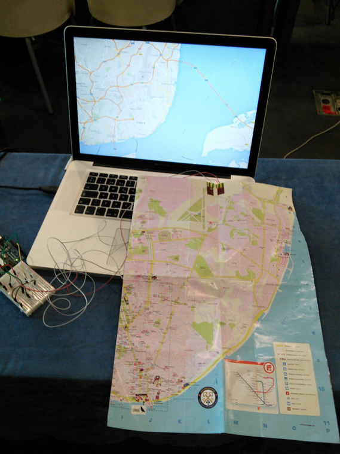
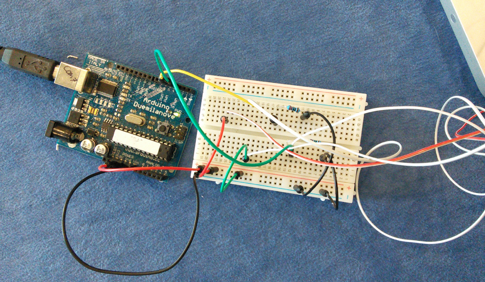

PaperMap
========

This repository contains a prototype that turns a traditional paper map into an interface. 

Prototyped in the Workshop [_Next Steps in OUIs: Crafting Interactions with Deformable and Actuated Display Surfaces_](http://shapechangingui.org/) at the [ACE2014](http://ace2014.info) Conference in Funchal, Madeira.

### Concept

Visiting a new city is always a good chance to use paper maps again to discover the city. When we walk through different districts or neighbourhoods we usually fold maps to focus on this region and save some space.

This concept tries to take the physical properties of a paper map (deformable, foldable, etc.) and use it as an interface or controller.

Observing how people interact with traditional paper maps (e.g. gestures, shape transformation, use with others, mark directions or points of interest, etc.) could inspire other concepts, for example, to translate interaction into digital maps, augmenting paper maps with digital content, etc.

### Prototype

In this example, by folding and unfolding the map, you can control the zoom of a digital replica of it. It is still very simple but should work as a proof of concept. 

It uses Arduino and the [Unfolding](http://unfoldingmaps.org/) library for Processing.

